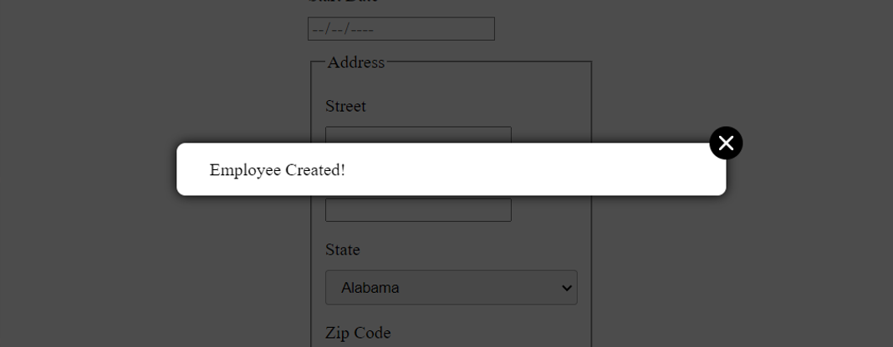

# Little confirmation Modal

Create a little modal with a confirmation message and a close button. This modal is a React's component.

## How to add the modal

### Installation
Add the modal to your project by executing `npm i manon-modal-projet14`

### Usage
Here's an example of usage :

    import { ManonModal } from 'manon-modal-projet14/dist'
    import { useState } from "react"

    function MyApp() {
        const [isModalVisible, setIsModalVisible] = useState(false)

        const handleSubmit = () => {
            // add conditions before the action to confirmed
            setIsModalVisible(true)
        }

        return (
            

                <button onClick={handleSubmit}>Save</button>
                {isModalVisible &&
                    <ManonModal methodeOff={() => setIsModalVisible(false)} />
                }
            

        )
    }

### Visual example
